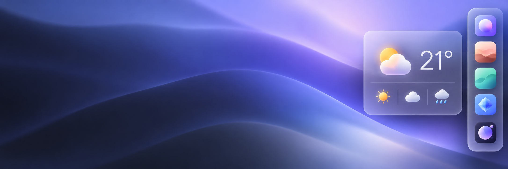

<p align="center">
  
</p>

<h1 align="center">Sidedoor</h1>

<p align="center">
  A second dock that hides at the edge of your screen.<br>
  App launchers and live widget cards, one flick of the pointer away.
</p>

<p align="center">
  <a href="https://github.com/lassejlv/sidedoor/releases/latest"></a>
  <a href="https://github.com/lassejlv/sidedoor/actions/workflows/macos.yml"></a>
  <a href="https://github.com/lassejlv/sidedoor/actions/workflows/linux.yml"></a>
  <a href="https://github.com/lassejlv/sidedoor/actions/workflows/windows.yml"></a>
</p>

---

Sidedoor stays off screen until the pointer touches its edge, then slides in
with your apps and a few small widgets. Click an app, glance at a card, and
it's gone again, without taking focus from the app you were in. It's built
in Rust with [GPUI Kit](https://crates.io/crates/gpui-kit) and aims to look
like it shipped with the OS.

## Features

- **Hides until you reach for it.** The dock appears at the screen edge you
  choose and gets out of the way the moment you leave. The reveal logic
  ignores a pointer that just drifts past.
- **App launchers.** Drag apps in, reorder them, see which are running, and
  give any item a global keyboard shortcut.
- **Widget cards.** Hover an item to open its card. **Weather**, **Stats**
  (CPU, memory, disk) and **Clipboard** come built in.
- **Clipboard History.** Text and images you copy, searchable, a shortcut
  away: <kbd>⌃</kbd><kbd>⌘</kbd><kbd>V</kbd> on a Mac,
  <kbd>Ctrl</kbd><kbd>Alt</kbd><kbd>V</kbd> on Windows and Linux.
- **Plugins in TSX.** Write your own widgets with the
  [Sidedoor SDK](sdk/README.md). They're drawn with native GPUI elements,
  with no web view, and reload as you save. Install others' plugins from a
  GitHub, Git or archive link.
- **Native feel.** It follows light and dark mode, Reduce Motion, Reduce
  Transparency and Increase Contrast. See [DESIGN.md](DESIGN.md).

## Download

Get the latest build from
[**Releases**](https://github.com/lassejlv/sidedoor/releases/latest). Every
package includes Bun and the plugin SDK, so there's nothing else to install.

| Platform | File | |
| --- | --- | --- |
| macOS (Apple Silicon) | `Sidedoor-macos-arm64.zip` | Unzip and move `Sidedoor.app` to Applications |
| Linux (x86_64, X11) | `Sidedoor-linux-x86_64.tar.gz` | Extract and run `./sidedoor` |
| Windows (x64) | `Sidedoor-windows-x64.zip` | Extract the whole folder and run `Sidedoor.exe` |

Each file has a `.sha256` checksum next to it.

> [!NOTE]
> The macOS app isn't notarized yet. The first time, right-click it and
> choose **Open**, or run
> `xattr -dr com.apple.quarantine /Applications/Sidedoor.app`.

## Using it

- **Settings:** right-click the dock and choose **Dock Settings…**, or use
  the menu bar or tray icon.
- **Add apps:** drag them onto the dock, or use **Settings › Items**.
- **Add widgets:** turn them on under **Settings › Plugins**.
  **New Plugin** creates a working widget and opens its code.
- **Where things are kept:**

  | Platform | Settings and plugins |
  | --- | --- |
  | macOS | `~/Library/Application Support/Sidedoor` |
  | Linux | `~/.local/share/sidedoor` |
  | Windows | `%APPDATA%\Sidedoor` |

## Writing a plugin

A plugin is a folder with an `index.tsx`:

```tsx
import { Button, Card, definePlugin, useState } from "@sidedoor/sdk";

export default definePlugin({
  name: "Counter",
  icon: "hash",
  card() {
    const [count, setCount] = useState(0);
    return (
      <Card title="Counter">
        <div text_size={32} font_weight="semibold">{count}</div>
        <Button variant="primary" label="Add" on_click={() => setCount(count + 1)} />
      </Card>
    );
  },
});
```

Plugins run with the same access as the app, so only add ones from people
you trust. The [SDK guide](sdk/README.md) covers settings, tiles, windows,
native data, testing and sharing.

## Platform notes

### macOS

Needs macOS 15 or later. Build and install from source with
`./scripts/package/macos.sh --install`.

### Linux

Sidedoor runs on X11 desktops and has been checked on GNOME (Mutter), KDE
(KWin) and Xfce. Wayland doesn't let an app follow the pointer or place a
dock, so under Wayland it runs through XWayland, where revealing the dock
isn't reliable yet. Choose the X11 session (for example "GNOME on Xorg") at
login.

The tray icon (Settings, Launch at Login, Reload, Quit) appears on desktops
that show StatusNotifierItems. The dock's context menu always has **Dock
Settings…**. Text uses [Inter](https://rsms.me/inter/) when it's installed.

`./scripts/package/linux.sh --install` installs for the current user into
`~/.local/opt/sidedoor`, with a launcher entry and an icon.

### Windows

The Windows port is still being tested on real desktops. The
[Windows test checklist](docs/windows-testing.md) covers installation, data
paths and what to check. Use the tray icon for Settings.

## Building from source

You need [Rust](https://rustup.rs) (stable) and [Bun](https://bun.sh) 1.4.

```sh
cd sdk && bun install --frozen-lockfile && cd ..
cargo run
```

<details>
<summary><b>Linux build libraries</b></summary>

```sh
sudo apt install libxkbcommon-dev libxkbcommon-x11-dev libwayland-dev \
  libvulkan-dev libfontconfig-dev libx11-xcb-dev libxcb-xkb-dev fonts-inter
```

</details>

<details>
<summary><b>Windows build tools</b></summary>

Install Rust with the MSVC toolchain, Visual Studio C++ Build Tools with a
Windows SDK (including `fxc.exe`), and Bun. Then:

```powershell
cd sdk
bun install --frozen-lockfile
cd ..
./scripts/package/windows.ps1
```

</details>

### Packaging

| Script | Output |
| --- | --- |
| `scripts/package/macos.sh` | `target/release/bundle/Sidedoor.app` |
| `scripts/package/linux.sh` | `target/release/bundle/Sidedoor-linux-<arch>.tar.gz` |
| `scripts/package/windows.ps1` | `target/windows-bundle/Sidedoor-windows-x64.zip` |

Publishing a GitHub release as a **pre-release** builds all three with the
[Release workflow](.github/workflows/release.yml), attaches them, and marks
the release as latest.

## Project layout

The root is a virtual Cargo workspace. `cargo run` starts the `desktop`
crate's `sidedoor` binary.

| Crate | Responsibility |
| --- | --- |
| [`desktop`](crates/desktop) | Startup, app state, shared GPUI views, built-in TSX plugins, icons |
| [`domain`](crates/domain) | Pure models, config schema and migrations, clipboard rules, geometry, motion |
| [`platform`](crates/platform) | macOS, Windows and Linux APIs, native windows, clipboard, shortcuts, tray, paths |
| [`services`](crates/services) | Config and history storage, weather, system stats, image downloads |
| [`plugin-host`](crates/plugin-host) | Plugin manifests, protocol, discovery, installs from links, reload, Bun supervisor |
| [`sdk`](sdk) | The TypeScript plugin SDK, a separate Bun package |

See [architecture](docs/architecture.md) for dependency rules and
[DESIGN.md](DESIGN.md) for how it should look and feel.

## Checks

```sh
cargo fmt --all --check
cargo test --workspace --locked
cargo clippy --workspace --locked --all-targets -- -D warnings
cd sdk && bun test && bun run check
```

On an isolated Windows test session, CI also checks native clipboard round
trips and launches the packaged app. The clipboard test is ignored by default
because it replaces the session's clipboard contents.
