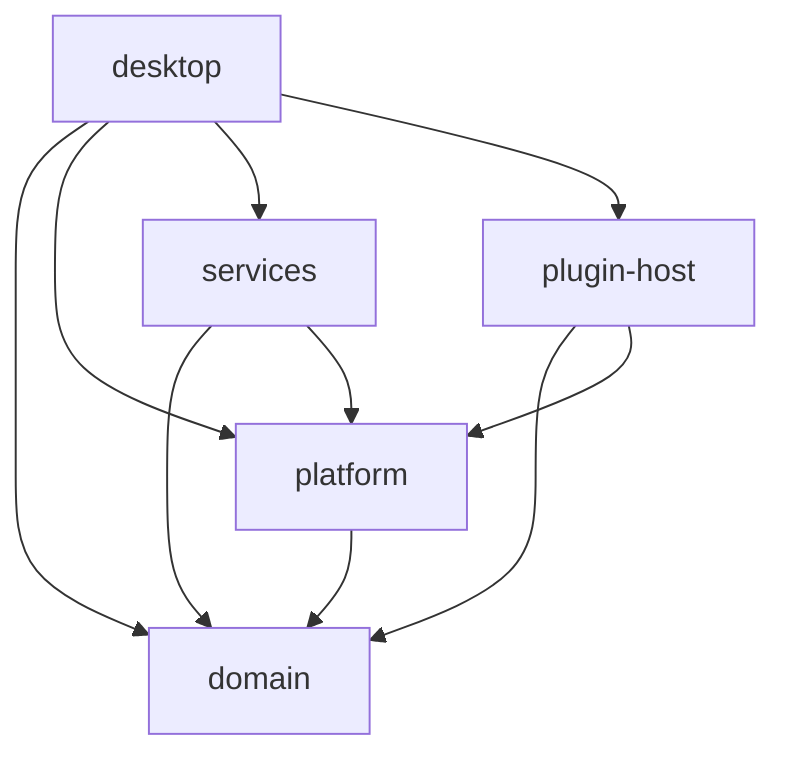

# Architecture

The repository root contains workspace configuration, the TypeScript SDK, documentation,
and build automation. Application sources and assets belong to crates.

```text
.
├── Cargo.toml                    # Virtual workspace, shared dependencies and profiles
├── Cargo.lock
├── crates/
│   ├── desktop/
│   │   ├── Cargo.toml            # Package desktop; executable sidedoor
│   │   ├── build.rs              # Windows executable resources
│   │   ├── assets/icons/
│   │   └── src/
│   │       ├── main.rs
│   │       ├── app/              # Startup, dock state, host composition, windows, shortcuts
│   │       ├── ui/               # Dock, clipboard, settings, plugins, shared theme
│   │       └── builtins/         # Weather, Stats and Clipboard TSX plugins
│   ├── domain/src/               # Pure models and state transitions
│   ├── platform/src/             # Native API contract, paths, macos/ and windows/
│   ├── services/src/             # Persistence, weather, stats and image IO
│   └── plugin-host/src/          # Manifest, protocol, discovery, GitHub installs, runtime, reload and SDK
├── sdk/                          # Independent Bun/TypeScript package
├── scripts/
│   ├── package/                  # macos.sh and windows.ps1
│   └── smoke/                    # windows.ps1
├── docs/
└── .github/workflows/            # macOS, Windows and SDK checks
```

## Dependency rules



- `domain` has no GPUI, native APIs, networking, subprocesses, or filesystem IO.
  Clipboard image equality accepts a comparator so file reads remain in `services`.
- `platform` provides native operations and presentation through one contract. Its
  GPUI dependency bridges native window handles. It does not depend on services
  or the plugin host.
- `services` owns fetching and persistence; `plugin-host` owns plugin processes
  and protocol messages. Neither imports desktop views.
- `desktop::app::host` composes native operations, storage, and plugin startup.
  UI tests substitute an in-memory host while exercising the real built-in TSX.
- Rust sends live data to built-in plugins through the same protocol used by
  user plugins. Shared GPUI rendering preserves the existing widget appearance.

## Development and packaging

`cargo run` uses the workspace's default member, `desktop`. Run checks against
`--workspace` so library tests are included; use `cargo fmt --all --check` for
formatting. The root owns the lockfile, release profile, shared metadata and
shared dependency versions.

Built-in source imports point to the root SDK. Development resource lookup is
relative to each owning crate's manifest. Packaging compiles built-ins into the
app resources and includes Bun and the SDK, so installed builds do not rely on
a checkout or a system Bun installation. The executable name, bundle identity,
saved configuration, clipboard history, and user plugin locations are unchanged.
