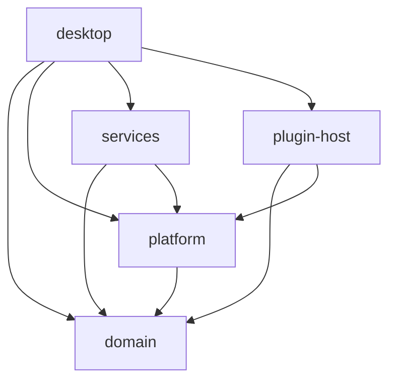

# Architecture

The repository root contains workspace configuration, the TypeScript SDK, documentation,
and build automation. Application sources and assets belong to crates.

```text
.
├── Cargo.toml                    # Virtual workspace, shared dependencies and profiles
├── Cargo.lock
├── crates/
│   ├── desktop/
│   │   ├── Cargo.toml            # Package desktop; executable sidedoor
│   │   ├── build.rs              # Windows executable resources
│   │   ├── assets/icons/
│   │   └── src/
│   │       ├── main.rs
│   │       ├── app/              # Startup, dock state, host composition, windows, shortcuts
│   │       └── ui/               # Dock, settings, plugins, shared theme
│   ├── domain/src/               # Pure models and state transitions
│   ├── platform/src/             # Native API contract, paths, macos/, windows/ and linux/
│   ├── services/src/             # Persistence, the plugin gallery, updates and image IO
│   └── plugin-host/src/          # Manifest, protocol, discovery, installs from links, runtime, reload and SDK
├── sdk/                          # Independent Bun/TypeScript package
├── plugins/                      # Official plugins and the gallery list
├── skills/sidedoor-plugins/      # Agent skill for writing plugins (linked from .claude/skills)
├── scripts/
│   ├── package/                  # macos.sh, windows.ps1 and linux.sh
│   └── smoke/                    # windows.ps1
├── docs/
└── .github/workflows/            # macOS, Windows, Linux and SDK checks
```

## Dependency rules



- `domain` has no GPUI, native APIs, networking, subprocesses, or filesystem IO.
- `platform` provides native operations and presentation through one contract. Its
  GPUI dependency bridges native window handles. It does not depend on services
  or the plugin host.
- On Linux, `platform` keeps its own X11 connection. A foreground task in
  `desktop` calls `native::pump` to advance window animations and deliver
  shortcuts and tray commands, since X11 has no run loop to attach them to.
- `services` owns fetching and persistence; `plugin-host` owns plugin processes
  and protocol messages. Neither imports desktop views.
- `desktop::app::host` composes native operations, storage, and plugin startup.
  UI tests substitute an in-memory host.
- The app has no widgets of its own. Weather, Stats and Clipboard are official
  plugins in `plugins/`, installed from the gallery like any other, and get
  their data with Bun rather than from the app.

## Development and packaging

`cargo run` uses the workspace's default member, `desktop`. Run checks against
`--workspace` so library tests are included; use `cargo fmt --all --check` for
formatting. The root owns the lockfile, release profile, shared metadata and
shared dependency versions.

Development resource lookup is relative to each owning crate's manifest.
Packaging includes Bun and the SDK, so installed builds do not rely on a
checkout or a system Bun installation. Saved configurations from before the
official plugins point their Weather, Stats and Clipboard items, shortcuts and
weather place at the plugins, which appear once installed.
